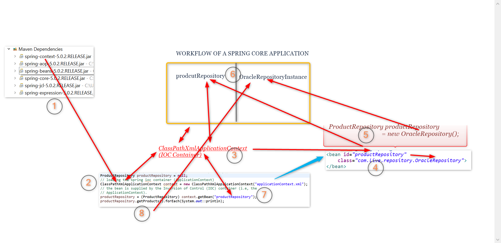

:beginner: **Lab 3**

:lock: analyze the code below and try to inject both the repository dependencies

```java
package com.live.config;

import org.springframework.context.annotation.Bean;
import org.springframework.context.annotation.Configuration;

import com.live.repository.MySqlRepository;
import com.live.repository.ProductRepository;
import com.live.service.ProductService;
import com.live.service.ProductServiceImpl;

//Indicates that a class declares one or more @Bean methods
//and may be processed by the Spring container to generate bean definitions
//and service requests for those beans at runtime
@Configuration
//Configures component scanning directives for use with @Configuration classes.
//Configures component scanning directives for use with @Configuration classes.
//@ComponentScan("com.live")
public class AppConfig {
//	Indicates that a method produces a bean to be managed by the Spring container.
	@Bean
	public ProductRepository productRepository() {
		return new MySqlRepository();
	}

	@Bean
	public ProductService productService() {
		return new ProductServiceImpl(productRepository());
	}
}

```

:lock: - analyze the program below and try

- inject oracleRepository and mySQLRepository into coolServiceMethod()

```java
package com.live.service;

import java.util.List;

import org.springframework.beans.factory.annotation.Qualifier;
import org.springframework.stereotype.Service;

import com.live.model.Product;
import com.live.repository.ProductRepository;

//Indicates that an annotated class is a "Service",
//originally defined by Domain-DrivenDesign (Evans, 2003) as
//"an operation offered as an interface that stands alone in themodel,
//with no encapsulated state."
@Service("productService")
public class ProductServiceImpl implements ProductService{

	//Marks a constructor, field, setter method or config method as to be
	//autowired by Spring's dependency injection facilities.
	//FIELD INJECTION
//	@Autowired
//	This annotation may be used on a field or parameter
//	as a qualifier for candidate beans when autowiring.
//	@Qualifier("mySqlRepository")
	ProductRepository productRepository1;
	ProductRepository productRepository2;

//	ProductRepository productRepository = new OracleRepository();
//	ProductRepository productRepository = new MySqlRepository();


	//CONSTRUCTOR BASED INJECTION
	public ProductServiceImpl(@Qualifier("oracleRepository")ProductRepository productRepository1,@Qualifier("mySqlRepository")ProductRepository productRepository2) {
		this.productRepository1 = productRepository1;
		this.productRepository2 = productRepository2;
	}

	public ProductRepository getProductRepository1() {
		return productRepository1;
	}

	public ProductRepository getProductRepository2() {
		return productRepository2;
	}

	public ProductRepository coolServiceMethod() {
	System.out.println("ProductRepository coolServiceMethod() >>" + productRepository1);
	return productRepository1;
}
//	@Autowired
//	public ProductRepository getProductRepository() {
//		return productRepository1;
//	}

	//PROPERTY BASED INJECTION
//	public void setProductRepository(ProductRepository productRepository) {
//
//		this.productRepository = productRepository;
//	}


	@Override
public List<Product> getProducts() {
//		ProductRepository productRepository = new OracleRepository();
//		ProductRepository productRepository = new MySqlRepository();
	return productRepository1.getProducts();
}
}

```

:beginner: **Lab 2** Create a master application which has all types of di.

:beginner: **Lab 1**

:lock: Analyze the enterprise project skeleton

1. Implement the repository layer to fetch the employee records
2. The employee records should be populated in a collection.
3. The collection should pass through the service layer, back to the application.
4. The application should print the records.

:lock: Migrate the application `ld1a-xml-ioc` which is using spring to a traditional application without spring.

1. Remove spring framework
2. Implement Oracle & MySQL repositories as singleton

:key: Write down the description for all the steps

